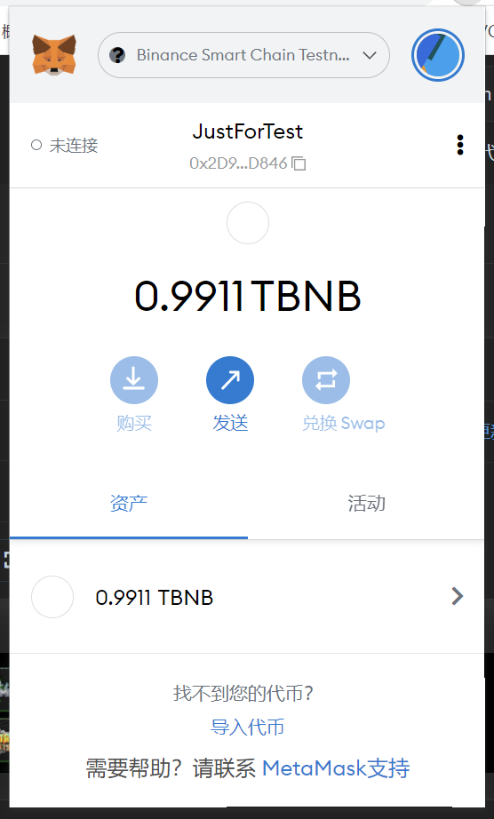

执行的转账Hash:
`https://testnet.bscscan.com/tx/0x2934d4fe2c8583a518912e0bf676b1406ce6bfd0758efb5a8343ae9b13bdc653`

创建好的MetaMask地址:
     

使用Remix创建的合约地址(counter.sol):
`https://testnet.bscscan.com/address/0x16Ed8015e45872F3ee25694a9d1F3bDC8e345054`