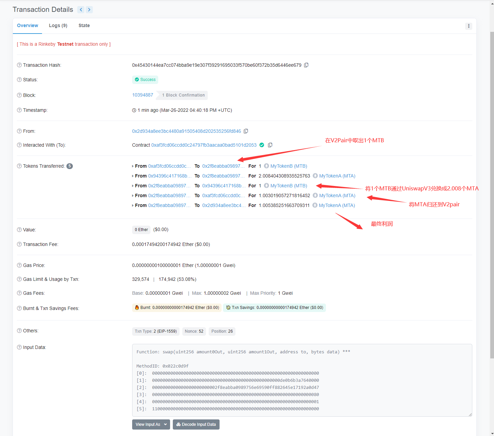

# Basic Sample Hardhat Project

This project demonstrates a basic Hardhat use case. It comes with a sample contract, a test for that contract, a sample script that deploys that contract, and an example of a task implementation, which simply lists the available accounts.

Try running some of the following tasks:

```shell
npx hardhat accounts
npx hardhat compile
npx hardhat clean
npx hardhat test
npx hardhat node
node scripts/sample-script.js
npx hardhat help
```


闪电贷套利hash:
    https://rinkeby.etherscan.io/tx/0x45430144ea7cc074bba9e19e307f39291695033f570be60f372b35d6446ee679

效果图:
    
