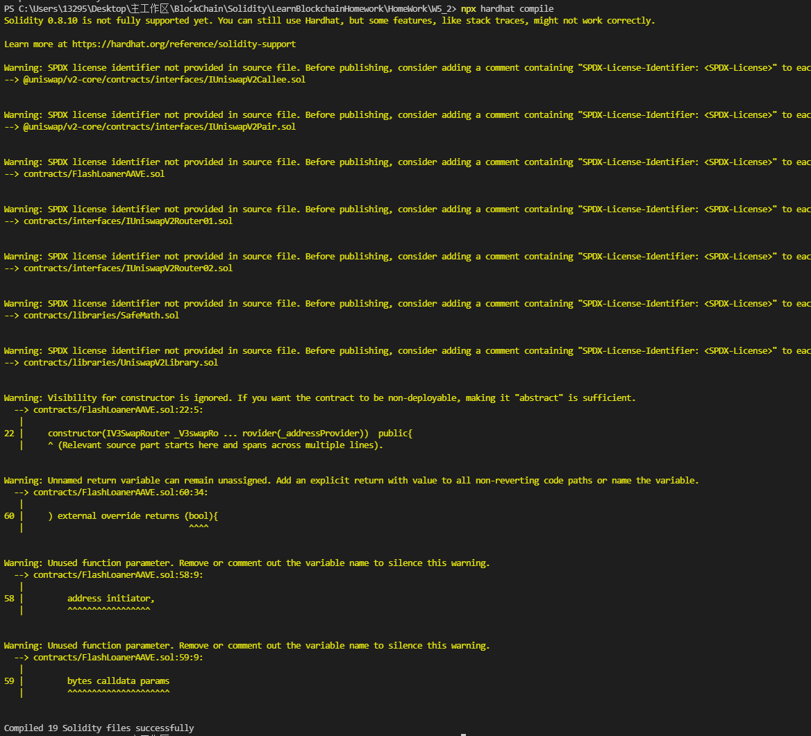

# Basic Sample Hardhat Project

This project demonstrates a basic Hardhat use case. It comes with a sample contract, a test for that contract, a sample script that deploys that contract, and an example of a task implementation, which simply lists the available accounts.

Try running some of the following tasks:

```shell
npx hardhat accounts
npx hardhat compile
npx hardhat clean
npx hardhat test
npx hardhat node
node scripts/sample-script.js
npx hardhat help
```

`
    由于AAVE测试网合约测试条件较复杂...只编写了合约没有实际测试
    主文件: ** ./contracts/FlashLoanerAAVE.sol **
    编译已通过
`

效果图:
    

