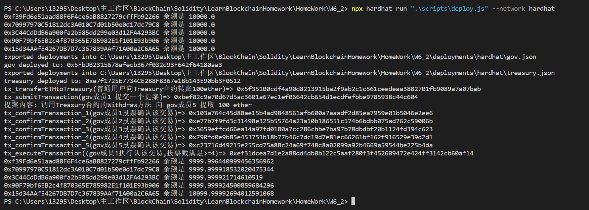

# Basic Sample Hardhat Project

This project demonstrates a basic Hardhat use case. It comes with a sample contract, a test for that contract, a sample script that deploys that contract, and an example of a task implementation, which simply lists the available accounts.

Try running some of the following tasks:

```shell
npx hardhat accounts
npx hardhat compile
npx hardhat clean
npx hardhat test
npx hardhat node
node scripts/sample-script.js
npx hardhat help
```
测试环境: hardhat本地网络
```
    部署+调试 GOVDAO and Treasury:
        run: npx hardhat run ".\scripts\deploy.js" --network hardhat
```

效果图: 
